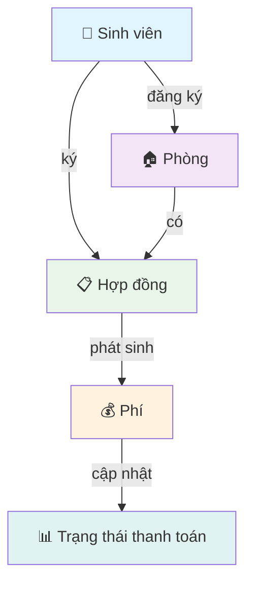
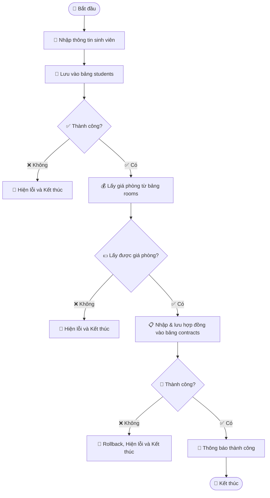

# 🏠 OOP_N01_Term3_2025_K17_Group9

<div align="center">

# 🎯 Dormitory Management System
### *OOP Term Project - Group 9*

[](https://www.java.com/)
[](https://spring.io/projects/spring-boot)
[](https://www.mysql.com/)
[](https://github.com/)

*Một ứng dụng quản lý ký túc xá hiện đại, được xây dựng với Java Spring Boot*

---

### 👥 **Team Members**

| 🧑‍💻 Member | 🔗 GitHub |
|:-----------|:----------|
| **Nguyễn Tùng Bách** | [@BachNguyenn](https://github.com/BachNguyenn) |
| **Nguyễn Thành Dương** | [@ThanhhDuongg](https://github.com/ThanhhDuongg) |
| **Lê Duy Thái Dương** | [@Nora-LeDuong](https://github.com/Nora-LeDuong) |
| **Nguyễn Lệ Thu** | [@nglthu](https://github.com/nglthu) |

</div>

---

# 📋 Phần 1: Tổng quan về Project

## 🌟 1. Giới thiệu

> **Dormitory Management** là ứng dụng quản lý ký túc xá được phát triển bằng **Java Spring Boot**, cho phép quản lý toàn diện thông tin sinh viên, phòng ở, hợp đồng và phí dịch vụ trong ký túc xá. Ứng dụng hỗ trợ CRUD, giao diện web thân thiện, kiểm thử, lưu trữ dữ liệu lên Cloud MySQL và đáp ứng đầy đủ các tiêu chí của bài tập lớn OOP.

---

## ✨ 2. Tính năng nổi bật

<div align="center">

### **🔧 Các chức năng chính**

</div>

- 🎓 **Quản lý sinh viên:** thêm, sửa, xóa, tìm kiếm, hiển thị chi tiết, phân loại theo phòng, hợp đồng
- 🏠 **Quản lý phòng:** thêm, sửa, xóa, xem danh sách sinh viên trong từng phòng, loại phòng, số lượng giường
- 📋 **Quản lý hợp đồng:** lập hợp đồng ở, cập nhật ngày bắt đầu/kết thúc, trạng thái, liên kết sinh viên và phòng
- 💰 **Quản lý phí:** lưu và quản lý các loại phí (điện, nước, vệ sinh, v.v.), trạng thái thanh toán
- 🌐 **Giao diện đồ họa (web)** hiện đại, dễ sử dụng
- ⚠️ **Xử lý lỗi và kiểm thử tự động** (Test)
- ☁️ **Lưu trữ, thao tác dữ liệu** với Cloud MySQL và các Collection như ArrayList, Map…
- 📊 **Đầy đủ các yêu cầu** theo hướng dẫn báo cáo của trường

---

## 🛠️ 3. Công nghệ sử dụng

<div align="center">

### **Backend Technologies**


### **Frontend Technologies**


### **Database & Testing**


</div>

- **🔧 Backend:** Java, Spring Boot, Spring MVC, JPA/Hibernate
- **🎨 Frontend:** Thymeleaf, Bootstrap
- **🗄️ Database:** Cloud MySQL (Aiven), lưu trữ dữ liệu thực tế
- **🧪 Testing:** JUnit
- **📂 Quản lý mã nguồn:** GitHub

---

## 🏗️ 4. Kiến trúc dự án

```
🎯 Áp dụng mô hình MVC (Model - View - Controller)
```

<div align="center">

### **🔄 Các thành phần MVC**

| **📊 Model** | **🖼️ View** | **🎮 Controller** | **⚙️ Service** |
|:------------:|:----------:|:----------------:|:-------------:|
| Student | Web Interface | StudentController | Business Logic |
| Room | Thymeleaf Templates | RoomController | Data Processing |
| Contract | Bootstrap UI | ContractController | Service Layer |
| Fee, PaymentStatus, FeeType | Responsive Design | FeeController | Logic Coordination |

</div>

### 📁 **Cấu trúc thư mục**
```plain texttext
🗂️ OOP_N01_Term3_2025_K17_Group9/
├── 📁 src/
│   ├── 📁 main/
│   │   ├── 📁 java/com/example/dorm/
│   │   │   ├── 📁 config/    # Cấu hình (bảo mật)
│   │   │   │   └── 📄 SecurityConfig.java
│   │   │   ├── 🎮 controller/ # Xử lý điều hướng (Controller)
│   │   │   │   ├── 📄 ContractController.java
│   │   │   │   ├── 📄 DashboardController.java
│   │   │   │   ├── 📄 FeeController.java
│   │   │   │   ├── 📄 RoomController.java
│   │   │   │   └── 📄 StudentController.java
│   │   │   ├── ⚠️ exception/ # Xử lý ngoại lệ
│   │   │   │   └── 📄 GlobalExceptionHandler.java
│   │   │   ├── 📊 model/     # Các lớp mô hình dữ liệu
│   │   │   │   ├── 📄 Contract.java
│   │   │   │   ├── 📄 Fee.java
│   │   │   │   ├── 📄 FeeType.java
│   │   │   │   ├── 📄 PaymentStatus.java
│   │   │   │   ├── 📄 Room.java
│   │   │   │   └── 📄 Student.java
│   │   │   ├── 🗄️ repository/ # Tầng truy cập dữ liệu
│   │   │   │   ├── 📄 ContractRepository.java
│   │   │   │   ├── 📄 FeeRepository.java
│   │   │   │   ├── 📄 RoomRepository.java
│   │   │   │   └── 📄 StudentRepository.java
│   │   │   ├── ⚙️ service/   # Tầng logic nghiệp vụ
│   │   │   │   ├── 📄 ContractService.java
│   │   │   │   ├── 📄 FeeService.java
│   │   │   │   ├── 📄 RoomService.java
│   │   │   │   └── 📄 StudentService.java
│   │   │   └── 🚀 DormitoryApplication.java
│   │   └── 📁 resources/
│   │       ├── 🎨 static/   # Tài nguyên tĩnh (CSS, JS, hình ảnh)
│   │       │   ├── 📁 css/
│   │       │   │   └── 📄 style.css
│   │       │   └── 📁 images/
│   │       │       └── 📄 logo-phenikaa.png
│   │       ├── 🖼️ templates/ # Giao diện (các trang HTML)
│   │       │   ├── 📁 contracts/
│   │       │   │   ├── 📄 detail.html
│   │       │   │   ├── 📄 form.html
│   │       │   │   └── 📄 list.html
│   │       │   ├── 📁 fees/
│   │       │   │   ├── 📄 detail.html
│   │       │   │   ├── 📄 form.html
│   │       │   │   └── 📄 list.html
│   │       │   ├── 📁 fragments/
│   │       │   │   ├── 📄 header.html
│   │       │   │   └── 📄 sidebar.html
│   │       │   ├── 📁 rooms/
│   │       │   │   ├── 📄 detail.html
│   │       │   │   ├── 📄 form.html
│   │       │   │   └── 📄 list.html
│   │       │   ├── 📁 students/
│   │       │   │   ├── 📄 detail.html
│   │       │   │   ├── 📄 form.html
│   │       │   │   └── 📄 list.html
│   │       │   ├── 📄 dashboard.html
│   │       │   └── 📄 error.html
│   │       └── 📄 application.properties
│   └── 🧪 Test/ # Kiểm thử (Unit tests)
│       ├── 📁 java/com/example/dorm/
│       │   ├── 🎮 controller/ # Xử lý điều hướng (Controller)
│       │   │   ├── 📄 ContractControllerTest.java
│       │   │   ├── 📄 FeeControllerTest.java
│       │   │   ├── 📄 RoomControllerTest.java
│       │   │   └── 📄 StudentControllerTest.java
│       │   ├── 📊 model/     # Các lớp mô hình dữ liệu
│       │   │   ├── 📄 ContractTest.java
│       │   │   ├── 📄 FeeTest.java
│       │   │   ├── 📄 FeeTypeTest.java
│       │   │   ├── 📄 PaymentStatusTest.java
│       │   │   ├── 📄 RoomTest.java
│       │   │   └── 📄 StudentTest.java
│       │   └── ⚙️ service/   # Tầng logic nghiệp vụ
│       │       ├── 📄 ContractServiceTest.java
│       │       ├── 📄 FeeServiceTest.java
│       │       ├── 📄 RoomServiceTest.java
│       │       └── 📄 StudentServiceTest.java
│       └── 📄 TestAddStudentWithContract.java
├── 🏞️ Images/ # Hình ảnh thiết kế UML
│   ├── 📄 ActivityDiagram.png
│   ├── 📄 ClassDiagram.png
│   ├── 📄 SequenceDiagram.png
│   ├── 📄 UMLDiagram.png
│   └── 📄 UsecaseDiagram.png
├── 📁 Review/ # Hoạt động trên lớp
│   ├── 📄 Selector.java
│   ├── 📄 Sequence.java
│   └── 📄 TestSequence.java
├── 🛠️ mvnw.cmd
├── 🛠️ pom.xml
└── 📝 README.md
```

---

## 🎯 5. Đối tượng và chức năng (Objects & CRUD)

### 🔍 5.1. Đối tượng chính

<div align="center">

### **📊 Chi tiết các đối tượng**

</div>

#### 🎓 **Sinh viên (Student)**
- **📋 Thông tin cá nhân:** họ tên, ngày sinh, giới tính, quê quán, ...
- **📞 Thông tin liên hệ:** email, số điện thoại
- **🏠 Thông tin phòng ở:** phòng hiện tại
- **📋 Thông tin hợp đồng:** hợp đồng liên quan
- **🔧 CRUD:** Thêm, sửa, xóa, tìm kiếm, xem chi tiết

#### 🏠 **Phòng (Room)**
- **🏷️ Thông tin phòng:** số phòng, loại phòng, số giường, giá phòng, ...
- **👥 Danh sách sinh viên ở:** quản lý cư dân
- **🔧 CRUD:** Thêm, sửa, xóa, xem chi tiết

#### 📋 **Hợp đồng (Contract)**
- **🔗 Liên kết:** sinh viên ↔ phòng
- **📅 Thời gian:** ngày bắt đầu/kết thúc
- **💰 Tài chính:** giá phòng, hình thức thanh toán, ...
- **📊 Trạng thái:** hoạt động, kết thúc, tạm ngưng
- **🔧 CRUD:** Thêm, sửa, xóa, xem chi tiết

#### 💰 **Phí (Fee)**
- **⚡ Các loại phí:** điện, nước, vệ sinh, trạng thái thanh toán
- **💳 Quản lý thanh toán:** theo dõi và cập nhật
- **🔧 CRUD:** Thêm, sửa, xóa, xem chi tiết

---

## 🔄 6. Tương tác & hoạt động chính

### 🔗 **Liên kết giữa các đối tượng:**



- **🎯 Sinh viên đăng ký phòng** → sinh viên có hợp đồng phòng
- **🏠 Mỗi phòng có danh sách sinh viên** quản lý cư dân
- **📋 Mỗi hợp đồng liên kết** sinh viên và phòng, có ngày bắt đầu/kết thúc, trạng thái
- **💰 Phí liên kết với hợp đồng/sinh viên**, cập nhật trạng thái thanh toán

### 🔍 **Tính năng bổ sung:**
- **🔎 Tìm kiếm, lọc, thống kê** (filter, search, statistics)
- **↔️ Phân trang linh hoạt** với các nút số thứ tự và trước/sau để chuyển trang nhanh

#### Cách hoạt động
Backend sử dụng `Pageable` của Spring Data JPA để truy vấn đúng dữ liệu theo số trang được yêu cầu. Trên giao diện Thymeleaf, các số trang được lặp và tạo liên kết để người dùng nhảy trực tiếp đến trang bất kỳ.

### 🎯 **Hoạt động chính:**
- **📝 Quản lý chu trình** từ đăng ký ở ký túc xá → tạo hợp đồng → phát sinh phí → thanh toán

---

## 📊 7. UML Diagram & Sơ đồ thuật toán

<div align="center">

### **🎨 Sơ đồ UML:**


*📁 Đầy đủ các sơ đồ Use Case, Class Diagram, Sequence Diagram,... (xem file `/uml` trong repo hoặc báo cáo giấy)*

</div>

---

## ⚠️ 8. Xử lý lỗi và kiểm thử (Exception Handling & Testing)

### 🛡️ **Exception Handling:**
- **🔒 Try-catch blocks:** Tất cả các chức năng được bọc trong try-catch
- **🌐 GlobalExceptionHandler.java:** Xử lý lỗi toàn cục
- **📝 Clear error messages:** Hiển thị thông báo lỗi rõ ràng, không làm gián đoạn chương trình

### 🧪 **Testing:**
- **✅ Unit tests:** Cho các class nghiệp vụ chính
- **🔗 Integration testing:** Kiểm thử tương tác giữa components
- **📊 Test coverage:** Đảm bảo chất lượng code

---

## 🚀 9. Hướng dẫn cài đặt & chạy

### 📋 **Yêu cầu hệ thống:**
- ☕ **Java:** 17+ 
- 🛠️ **Maven:** 3.6+
- 🗄️ **MySQL:** 8.0+ (hoặc Cloud MySQL)
- 💻 **IDE:** IntelliJ IDEA, VS Code, Eclipse

### ⚡ **Cài đặt nhanh:**

```bash
# 1️⃣ Clone repository về máy
git clone https://github.com/BachNguyenn/dorm_web.git

# 2️⃣ Import project vào IDE (IntelliJ/VS Code/Eclipse)

# 3️⃣ Cấu hình application.properties để kết nối Cloud MySQL

# 4️⃣ Chạy ứng dụng
./mvnw spring-boot:run

# 5️⃣ Truy cập giao diện web tại
# http://localhost:8080
```

---

## 🔗 10. Liên kết hữu ích

<div align="center">

[](https://github.com/BachNguyenn/OOP_N01_Term3_2025_K17_Group9)
[](https://youtube.com)
[](https://docs.com)

</div>

- **📂 Source code:** [GitHub Repo](https://github.com/BachNguyenn/OOP_N01_Term3_2025_K17_Group9)
- **🎥 Demo Youtube:** (Thêm link nếu có)
- **📑 Báo cáo PDF:** (Thêm link nếu có)

---

## 📋 11. Phân công công việc dự án Quản lý Ký túc xá

### 👥 Danh sách thành viên và phân công

| 👤 **Thành viên**      | 🛠️ **Chức năng phụ trách**                                                                                                                                                                                               |
| ---------------------- | ------------------------------------------------------------------------------------------------------------------------------------------------------------------------------------------------------------------------- |
| **Nguyễn Thành Dương** | **Backend:**<br/>• Student (model, controller, service, repository)<br/>• Dashboard controller<br/>• application.properties<br/>**Frontend:**<br/>• Templates (student, contract)<br/>• Dashboard<br/>• Fragment (header) |
| **Lê Duy Thái Dương**  | **Backend:**<br/>• Room (model, controller, service, repository)<br/>• Config<br/>• Exception handling<br/>**Frontend:**<br/>• Templates (room, fee)<br/>• Error templates<br/>• Fragment (sidebar)                       |
| **Nguyễn Tùng Bách**   | **Backend:**<br/>• Fee & Contract (model, controller, service, repository)<br/>**Frontend:**<br/>• Style, Images                                                                                                          |
| **Nguyễn Lệ Thu**      | **Hướng dẫn & Giám sát:**<br/>• Hướng dẫn kỹ thuật<br/>• Review code<br/>• Giảng dạy, hỗ trợ nhóm                                                                                                                         |

---

### 📑 Mô tả đóng góp chính

* **Nguyễn Thành Dương**: Chịu trách nhiệm các chức năng backend và frontend liên quan đến quản lý sinh viên, dashboard, và cấu hình hệ thống.
* **Lê Duy Thái Dương**: Phụ trách toàn bộ module phòng (room) cả backend lẫn frontend, đồng thời xử lý cấu hình, lỗi và sidebar.
* **Nguyễn Tùng Bách**: Phát triển module phí và hợp đồng cả backend và frontend (giao diện, hình ảnh, style UI).
* **Nguyễn Lệ Thu**: Giám sát, hướng dẫn, hỗ trợ kỹ thuật toàn bộ project.

### 📊 Thống kê đóng góp (theo báo cáo)

---

## 📚 **Tài liệu tham khảo**

<div align="center">

### **📖 Nguồn học tập và tham khảo**

</div>

- 🎓 **Giáo trình OOP** Đại học Phenikaa 
- 🌱 **[Spring Boot Reference Documentation](https://docs.spring.io/spring-boot/docs/current/reference/html/)**
- 🗄️ **[Spring Data JPA Documentation](https://docs.spring.io/spring-data/jpa/docs/current/reference/html/)**
- ⚠️ **[Exception Handling in Spring Boot REST API - Baeldung](https://www.baeldung.com/exception-handling-for-rest-with-spring)**
- 🧪 **[Testing in Spring Boot (Spring Official)](https://spring.io/guides/gs/testing-web/)**
- 🛠️ **[Introduction to Maven - Baeldung](https://www.baeldung.com/maven)**

---

# 📝 Phần 2: Trả lời một số yêu cầu trong các hoạt động trên lớp

## 🎯 1. Tiêu đề của bài tập lớn cuối kỳ

<div align="center">

### **🏠 Phần mềm quản lý ký túc xá**
**(Dormitory Management)**

</div>

---

## 🔍 2. Phân tích các đối tượng chính

<div align="center">

### **📊 Hệ thống có 4 đối tượng chính:**

</div>

### 🎓 **Sinh viên (Student):**
- **👤 Thông tin cá nhân:** họ tên, ngày sinh, giới tính, quê quán, ...
- **📞 Thông tin liên hệ:** email, số điện thoại
- **🏠 Thông tin về phòng ở:** phòng hiện tại, lịch sử
- **📋 Thông tin về hợp đồng:** hợp đồng đang có

### 🏠 **Phòng (Room):**
- **🏷️ Thông tin về phòng:** số phòng, loại phòng, số giường, giá phòng, ...
- **👥 Danh sách sinh viên ở:** quản lý cư dân hiện tại

### 📋 **Hợp đồng (Contract):**
- **📄 Thông tin về hợp đồng:** mã hợp đồng, ngày bắt đầu, ngày kết thúc, giá phòng, hình thức thanh toán, ...

### 💰 **Phí (Fee):**
- **⚡ Thông tin về các loại phí:** phí điện, phí nước, phí vệ sinh, ...

---

## 📁 3. Cấu trúc folder của Project

```plaintext
🗂️ DormitoryManagement/
├── 📁 src/
│   ├── 📁 model/
│   │   ├── 🎓 Student.java
│   │   ├── 🏠 Room.java
│   │   ├── 📋 Contract.java
│   │   └── 💰 Fee.java
│   └── 🚀 Main.java
├── 🧪 test/
│   ├── ✅ TestStudent.java
├── 📝 README.md
```

---

## 🏗️ 4. Các class đã xây dựng

<div align="center">

### **📊 Chúng em viết 7 class cho 4 đối tượng đã xác định ở câu 2:**

</div>

### **🎯 Đối tượng chính:**
- **🎓 Đối tượng sinh viên:**
  - `Student` (class sinh viên)
  
- **🏠 Đối tượng phòng:**
  - `Room` (class phòng)
  
- **📋 Đối tượng hợp đồng:**
  - `Contract` (class hợp đồng)
  
- **💰 Đối tượng phí:**
  - `Fee` (class phí)

### **⚙️ Các class bổ sung:**
- **💳 FeeType** (loại phí)
- **📊 PaymentStatus** (trạng thái thanh toán)  
- **🚀 Main** (class chạy chương trình)

*🔧 (Các chức năng cơ bản của từng class đã trình bày ở Câu 2.)*

---

## 🧪 5. Kiểm thử lớp Student

<div align="center">

### **✅ Để kiểm tra tính đúng đắn và ổn định của lớp Student**

</div>

Chúng em thực hiện kiểm thử các chức năng chính sau:

- **➕ Tạo mới sinh viên** với đầy đủ thông tin cá nhân
- **📺 Hiển thị thông tin sinh viên** ra màn hình  
- **📝 Cập nhật, thay đổi thông tin** của sinh viên (ví dụ: số điện thoại, địa chỉ, email)

**🎯 Mục đích:** Việc kiểm thử giúp đảm bảo lớp Student hoạt động chính xác, các thuộc tính được gán và lấy đúng giá trị.

---

## 🔥 Chức năng chính: Thêm sinh viên kèm hợp đồng thuê KTX

<div align="center">

### **🎯 Mục tiêu**

*Khi người dùng nhập thông tin sinh viên mới, hệ thống sẽ tự động tạo quy trình hoàn chỉnh*

</div>

### **📋 Quy trình xử lý:**
1. **💾 Thêm sinh viên** vào bảng `students`
2. **💰 Lấy giá phòng** từ bảng `rooms`  
3. **📋 Thêm hợp đồng thuê** mới vào bảng `contracts`

---

### 🔄 I. Phân tích chức năng và phân chia công việc

#### **📊 1. Các bước xử lý**

<div align="center">

| 🔢 **Bước** | 📝 **Mô tả** | 👤 **Thành viên thực hiện** |
|:----------:|:-------------|:----------------------------|
| **1** | 💾 Nhập và lưu thông tin sinh viên vào bảng `students` | **Lê Duy Thái Dương** |
| **2** | 💰 Truy vấn lấy giá phòng từ bảng `rooms` dựa trên mã phòng | **Nguyễn Tùng Bách** |
| **3** | 📋 Nhập thông tin và lưu hợp đồng thuê vào bảng `contracts` | **Nguyễn Thành Dương** |

</div>

**🤝 Cả nhóm:** Tích hợp các hàm con thành quy trình hoàn chỉnh, kiểm thử và hoàn thiện báo cáo.

---

#### **🔄 2. Lưu đồ thuật toán**



---

### 🖼️ II. Ảnh chụp chạy kiểm thử

<div align="center">


*✅ Kết quả kiểm thử thành công cho chức năng thêm sinh viên kèm hợp đồng*

</div>

---

## 🌐 Giao diện website

### 🏠 **1. Giao diện chính**

<div align="center">

**🎨 Khi truy cập vào trang web sẽ có giao diện như sau:**


**ℹ️ Khi nhấn vào phần giới thiệu sẽ tạo pop-up để giới thiệu:**


</div>

---

### 👥 **2. Nhiệm vụ UI trong Practice 8**

<div align="center">

### **🎨 Phân công giao diện theo thành viên**

</div>

#### **📋 Lê Duy Thái Dương: Danh sách sinh viên**

<div align="center">


</div>

#### **👁️ Nguyễn Thành Dương: Chi tiết sinh viên**

<div align="center">


</div>

#### **➕ Nguyễn Tùng Bách: Thêm sinh viên**

<div align="center">


</div>

---

<div align="center">

## 🌟 **Cảm ơn bạn đã quan tâm đến dự án!**

### Made with ❤️ by **Group 9**


