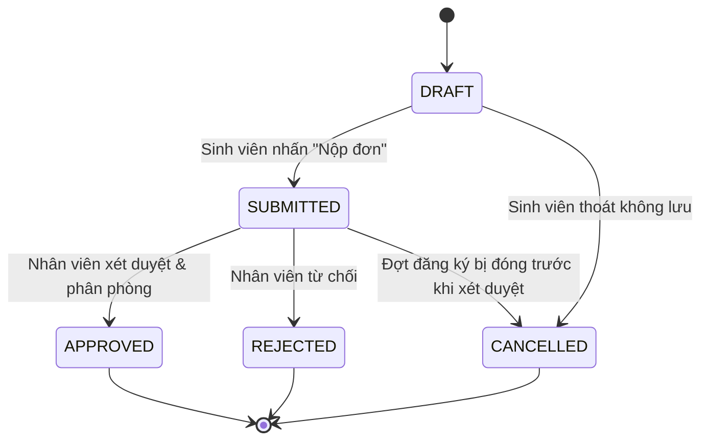

# Thiết kế luồng đăng ký Ký túc xá

Tài liệu mô tả thiết kế nghiệp vụ và các thành phần hệ thống phục vụ quy trình đăng ký KTX gồm các bước mở đợt đăng ký, sinh viên nộp đơn và đóng đợt đăng ký.

## 1. Bối cảnh và mục tiêu
- **Mục tiêu**: đảm bảo sinh viên có thể đăng ký chỗ ở đúng khung thời gian, dữ liệu được lưu trữ an toàn và ban quản lý dễ dàng xét duyệt.
- **Phạm vi**: các chức năng liên quan đến một đợt đăng ký KTX từ khi mở đến khi đóng.

## 2. Các tác nhân
| Tác nhân | Quyền hạn chính |
|----------|------------------|
| Quản trị viên/nhân viên KTX | Mở/đóng đợt đăng ký, theo dõi số lượng đơn, xét duyệt sau khi đợt kết thúc. |
| Sinh viên | Đăng nhập, điền và gửi đơn đăng ký trong thời gian đợt mở. |
| Hệ thống | Kiểm tra ràng buộc, lưu đơn đăng ký, thông báo kết quả thao tác. |

## 3. Trạng thái và dữ liệu cốt lõi
### 3.1 Thực thể chính
- **RegistrationPeriod**
  - Thuộc tính: `id`, `title`, `startDateTime`, `endDateTime`, `capacity`, `availableSlots`, `status {OPEN, CLOSED}`, `createdBy`.
  - Ràng buộc: chỉ một bản ghi có `status=OPEN` tại một thời điểm.
- **DormRoom** (tham chiếu khi xét duyệt, không dùng trực tiếp ở bước đăng ký nhưng cần để kiểm tra sức chứa tổng).
- **Student**
  - Thuộc tính: `studentCode`, `fullName`, `email`, `className`, `cohort`, `status {ACTIVE, SUSPENDED}`.
- **DormApplication**
  - Thuộc tính: `id`, `registrationPeriodId`, `studentId`, `submittedAt`, `status {DRAFT, SUBMITTED, CANCELLED, REJECTED, APPROVED}`, `desiredBuilding`, `desiredRoomType`, `motivation`, `attachments`.
  - Ràng buộc: (registrationPeriodId, studentId) duy nhất; `status=SUBMITTED` khi sinh viên gửi thành công.

### 3.2 Sơ đồ trạng thái đơn đăng ký

## 4. Dòng nghiệp vụ chi tiết
### 4.1 Mở đợt đăng ký
1. Quản trị viên đăng nhập, truy cập màn hình "Quản lý đợt đăng ký".
2. Chọn "Tạo đợt mới", nhập thời gian bắt đầu/kết thúc, chỉ tiêu.
3. Hệ thống kiểm tra: không có đợt `OPEN`, `startDateTime < endDateTime`, `capacity > 0`.
4. Nếu hợp lệ, hệ thống tạo bản ghi `RegistrationPeriod` với `status=OPEN`, khởi tạo `availableSlots=capacity`.
5. Ghi log audit và gửi thông báo (dashboard + email) cho sinh viên.

### 4.2 Sinh viên truy cập đăng ký
1. Sinh viên đăng nhập qua cổng sinh viên.
2. Dashboard kiểm tra:
   - Tồn tại `RegistrationPeriod` trạng thái `OPEN`.
   - Sinh viên chưa có `DormApplication` trạng thái `SUBMITTED` trong kỳ này.
3. Nếu đủ điều kiện, hiển thị nút "Đăng ký KTX" cùng thông tin đợt (thời gian, số chỗ còn lại, hướng dẫn).
4. Nếu không, thông báo lý do (chưa mở đợt, đã đăng ký, tài khoản bị khóa...).

### 4.3 Sinh viên điền đơn
1. Form đăng ký hiển thị các trường bắt buộc: thông tin cá nhân tự động điền từ hồ sơ, lựa chọn khu/loại phòng, lý do, upload file.
2. Client thực hiện validation cơ bản (trống, định dạng email, kích thước file).
3. Dữ liệu tạm thời lưu trên session/State của form; chưa ghi xuống DB.
4. Sinh viên có thể lưu nháp (`status=DRAFT`) nếu cần chỉnh sửa.

### 4.4 Sinh viên nộp đơn
1. Sinh viên nhấn "Nộp đơn".
2. Backend nhận request `POST /registration-periods/{id}/applications`.
3. Kiểm tra:
   - Đợt vẫn `OPEN` và `currentTime` trong khoảng `[startDateTime, endDateTime]`.
   - `availableSlots > 0`.
   - Sinh viên chưa có đơn `SUBMITTED`.
   - Thông tin form hợp lệ.
4. Nếu hợp lệ:
   - Lưu `DormApplication` với `status=SUBMITTED`, `submittedAt=now`.
   - Giảm `availableSlots` của `RegistrationPeriod` (sử dụng khóa lạc quan để tránh overbooking).
   - Ghi nhận lịch sử thao tác.
5. Trả về phản hồi thành công (JSON/HTML) cùng mã đơn.

### 4.5 Thông báo xác nhận
1. Sau khi lưu đơn, backend gửi event `ApplicationSubmitted`.
2. Listener gửi email + thông báo trong hệ thống cho sinh viên.
3. Giao diện chuyển hướng tới trang kết quả hiển thị trạng thái "Đã tiếp nhận - chờ duyệt".
4. Sinh viên có thể theo dõi trạng thái trong "Đơn đã nộp".

### 4.6 Đóng đợt đăng ký
1. Khi tới `endDateTime` hoặc `availableSlots=0`, hệ thống tự động chuyển `status=CLOSED` thông qua scheduled job (chạy mỗi 5 phút).
2. Quản trị viên cũng có thể nhấn "Đóng đợt" thủ công:
   - Hệ thống xác nhận và cập nhật `status=CLOSED`.
   - Từ chối các yêu cầu nộp đơn mới (trả mã lỗi 409 nếu gọi API).
3. Toàn bộ đơn `SUBMITTED` giữ nguyên để chờ xét duyệt, đơn `DRAFT` bị chuyển `CANCELLED`.

## 5. Giao diện và phân quyền
- **Admin Dashboard**: danh sách đợt đăng ký, số lượng đã đăng ký, nút mở/đóng.
- **Student Portal**: nút truy cập đơn trong thời gian mở, form nhiều bước (review thông tin -> chọn khu -> xác nhận).
- **Access Control**:
  - API tạo/đóng đợt: chỉ role `ADMIN` hoặc `STAFF`.
  - API nộp đơn: role `STUDENT` với trạng thái tài khoản `ACTIVE`.

## 6. Kiến trúc kỹ thuật
- **Controller layer**:
  - `RegistrationPeriodController`: REST + view cho admin.
  - `DormApplicationController`: form cho sinh viên.
- **Service layer**:
  - `RegistrationPeriodService`: quản lý trạng thái, đồng bộ số lượng chỗ.
  - `DormApplicationService`: chứa nghiệp vụ kiểm tra và lưu đơn.
- **Repository layer**: CRUD với `Spring Data JPA`, dùng khóa lạc quan (`@Version`).
- **Validation**: Hibernate Validator cho các ràng buộc bắt buộc.
- **Scheduled job**: `RegistrationPeriodScheduler` đóng đợt khi quá hạn.
- **Event**: `ApplicationSubmittedEvent` + listener gửi thông báo.

## 7. Trường hợp lỗi & thông báo
| Tình huống | Cách xử lý |
|------------|-----------|
| Không có đợt mở | Trả về thông báo "Chưa có đợt đăng ký" trên UI. |
| Hết chỉ tiêu | Nút nộp đơn bị vô hiệu hóa, API trả HTTP 409. |
| Sinh viên đã đăng ký | Hiển thị trạng thái đơn hiện tại, không cho tạo mới. |
| Đăng nhập sai quyền | Trả HTTP 403 và chuyển hướng tới trang đăng nhập. |
| Đóng đột ngột khi đang điền form | Khi submit, kiểm tra lại trạng thái, trả thông báo "Đợt đã kết thúc". |

## 8. Nhật ký và giám sát
- Ghi log audit cho hành động mở/đóng đợt, nộp đơn, thay đổi trạng thái xét duyệt.
- Dashboard thống kê: số đơn theo trạng thái, biểu đồ tiến độ đăng ký.
- Cảnh báo email khi gần hết chỉ tiêu (ví dụ: còn < 10%).

## 9. Mở rộng tương lai
- Tích hợp cổng thanh toán phí đặt cọc ngay sau khi đơn được duyệt.
- Cho phép sinh viên ưu tiên nhiều loại phòng và hệ thống xét tự động.
- Cung cấp API công khai để hệ thống khác (cổng thông tin trường) truy vấn trạng thái đăng ký.

